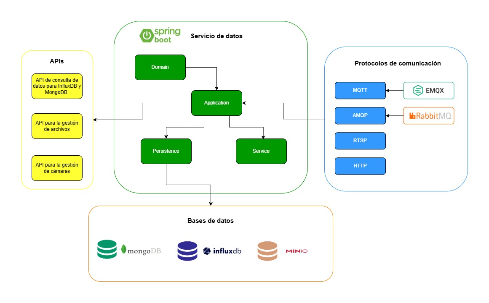

# Repositorio Microservicio de Datos/Mensajes IoT

En este repositorio se encuentra el código fuente del microservicio de almacenamiento de datos para la plataforma Smart Campus IoT UIS.

El microservicio está desarrollado en las siguientes tecnologías:

- Java 21
- Spring Boot 3.4.2
- InfluxDB 2.7 (docker influxdb:2.7)
- MongoDB (docker mongo latest)
- MinIO (docker quay.io/minio/minio)
- RabbitMQ 4.0-management (docker rabbitmq:4.0-management)
- EMQX 5.8 (docker emqx:5.8)

## Modulos del proyecto

| Módulo         | Propósito                                                                                         |
| -------------- |---------------------------------------------------------------------------------------------------|
| **application** | Exposición de endpoints REST, configuración de brokers EMQX Y RabbitMQ, manejo de CORS y Swagger. |
| **domain**      | Entidades de negocio y contratos de repositorio (interfaces).                                     |
| **service**     | Lógica de reencolado MQTT/AMQP y consultas a InfluxDB.                                            |
| **persistence** | Implementación para MongoDB, MinIO y InfluxDB.                                                    |

## Arquitectura 

## API Document.

Para conocer los EndPoin de la API que expone el microservicio se instalo el paquete de Swagger que permite documenta fácilmente, para acceder se expone por la URL base del servicio + */swagger-ui.html#/*

## Configuración del Entorno

Para ejecutar correctamente el microservicio, es necesario configurar las variables de entorno requeridas. Esto se logra mediante un archivo `.env` que debe estar ubicado en el directorio raíz del proyecto. Este archivo debe contener las variables necesarias para la configuración de las conexiones a las bases de datos, servicios de mensajería, almacenamiento, entre otros.

Para más detalles sobre cómo crear y configurar el archivo `.env`, consulta la sección correspondiente en la [Configuración del archivo .env](https://github.com/JulianCastillo14/data_microservice/wiki/Configuraci%C3%B3n-del-archivo-.env)
